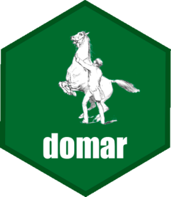

<!-- README.md is generated from README.Rmd. Please edit that file -->

```{r, include = FALSE}
knitr::opts_chunk$set(
  collapse = TRUE,
  comment = "#>",
  fig.path = "man/figures/README-",
  out.width = "100%"
)
```

# domar 

<!-- badges: start -->
[](https://github.com/drdsdaniel/domar/actions)
<!-- badges: end -->

The goal of domar is to get administrative registries data from corresponding source, restructered it in tabular form. Besides `domar` give functions for storage this data in Google Sheets.

## Installation

domar is not suitable for CRAN.

You can install the development version from [GitHub](https://github.com/) with:

``` r
# install.packages("devtools")
devtools::install_github("drdsdaniel/domar", build_vignettes=TRUE)
```

If you have a binary build, which is likely, install it.

## Starting

Once you have followed the above instructions and installed the package. Run `browseVignettes('domar')` in the R console to get more detailed instructions on the use of the package.

<!-- Asegurate de tener una sola instancia corriendo al mismo tiempo en el cron. O aún mejor, que cada instancia sea la que crea un nuevo cron al salir -->
